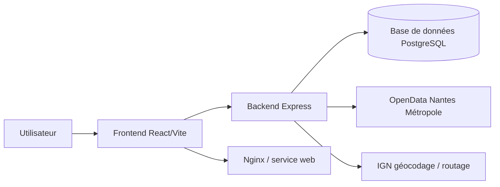

# DAPI - Application de cartographie PMR à Nantes

DAPI est une application web visant à faciliter la recherche d'emplacements de stationnement accessibles pour les personnes à mobilité réduite dans la métropole nantaise. Le projet combine une interface React/Vite, une API Node.js/Express et une base de données PostgreSQL, avec des données issues d'OpenData et des services de géocodage/itinéraires.

## 1. Description du projet

### Objectif

L'application permet à un utilisateur de :
- visualiser des emplacements PMR sur une carte interactive ;
- rechercher une adresse ou une destination ;
- calculer un itinéraire vers un endroit ciblé ;
- consulter des informations détaillées sur les places accessibles et leur contexte local.

### Pile technique

- Frontend : React 19 + Vite + Leaflet + React-Leaflet
- Backend : Node.js + Express
- Base de données : PostgreSQL
- Conteneurisation : Docker + Docker Compose
- Reverse proxy / livraison : Nginx (frontend) et image Docker prête pour un déploiement sur VPS ou environnement cloud

## 2. Architecture

### Schéma de l'architecture



### Composants principaux

- Frontend : application web interactive et responsive
- Backend : API REST exposée sur le port 3002 en local
- Base de données : stockage des communes et emplacements PMR
- Services externes : données OpenData et géocodage/itinéraires

### Structure du dépôt

```text
.
├── backend/              # API Node.js/Express
├── public/               # Ressources statiques
├── src/                  # Code frontend React/Vite
├── docker-compose.yml    # Stack locale de développement
├── docker-compose.prod.yml # Stack de production
├── Dockerfile            # Image du frontend
├── backend/Dockerfile    # Image du backend
├── .env.example          # Variables d'environnement de référence
└── README.md             # Documentation principale
```

## 3. Prérequis

Avant de lancer le projet, assurez-vous d'avoir :
- Docker Engine 24+ et Docker Compose v2
- Node.js 20+ (si vous voulez exécuter le frontend/backend sans conteneur)
- Git
- Un terminal compatible bash/zsh

## 4. Lancer l'application en local

### Option A - Avec Docker Compose (recommandée)

1. Clonez le dépôt :
   ```bash
   git clone <url-du-repo>
   cd dapi
   ```

2. Copiez le fichier d'exemple d'environnement :
   ```bash
   cp .env.example .env
   ```

3. Adaptez les variables à votre environnement local :
   ```bash
   nano .env
   ```

4. Démarrez les services :
   ```bash
   docker compose up --build -d
   ```

5. Vérifiez l'état des conteneurs :
   ```bash
   docker compose ps
   ```

6. Ouvrez les services :
   - Frontend : http://localhost:3002
   - Backend : http://localhost:3001
   - Base de données : localhost:5432

7. Pour arrêter la stack :
   ```bash
   docker compose down
   ```

### Option B - Développement local sans conteneur

1. Installer les dépendances du frontend :
   ```bash
   npm install
   ```

2. Lancer le frontend :
   ```bash
   npm run dev
   ```

3. Dans un second terminal, installer et lancer le backend :
   ```bash
   cd backend
   npm install
   npm run dev
   ```

4. Assurez-vous qu'une base de données PostgreSQL est accessible et que le fichier .env pointe vers cette base.

## 5. Déployer en production

### Pré-requis serveur

- VPS ou machine cloud avec Docker installé
- Accès SSH
- Domaine ou IP publique
- Optionnel : reverse proxy Nginx/Caddy + TLS

### Procédure complète

1. Copiez le dépôt sur le serveur :
   ```bash
   git clone <url-du-repo>
   cd dapi
   ```

2. Créez et renseignez le fichier .env avec les variables de production :
   ```bash
   cp .env.example .env
   nano .env
   ```

3. Vérifiez que la configuration de production est correcte :
   ```bash
   docker compose -f docker-compose.prod.yml config
   ```

4. Téléchargez et démarrez les services :
   ```bash
   docker compose -f docker-compose.prod.yml pull
   docker compose -f docker-compose.prod.yml up -d
   ```

5. Vérifiez les logs et l'état :
   ```bash
   docker compose -f docker-compose.prod.yml ps
   docker compose -f docker-compose.prod.yml logs -f
   ```

6. Si vous utilisez un reverse proxy, configurez-le pour pointer vers le port exposé du frontend (par défaut 3001).

7. Pour mettre à jour la version déployée :
   ```bash
   git pull
   docker compose -f docker-compose.prod.yml pull
   docker compose -f docker-compose.prod.yml up -d --force-recreate
   ```

8. Pour sauvegarder les données persistantes, sauvegardez le volume Docker associé à la base de données.

## 6. Variables d'environnement

Le fichier .env.example sert de référence. Les variables suivantes doivent être définies selon votre contexte :

| Variable | Description | Exemple |
| --- | --- | --- |
| DB_HOST | Hôte de la base de données | db |
| DB_USER | Nom d'utilisateur de la base | dapi |
| DB_PASSWORD | Mot de passe de la base | change-me |
| DB_NAME | Nom de la base de données | dapi |
| DB_ROOT_PASSWORD | Mot de passe administrateur de la base | change-me |
| PORT | Port d'écoute du backend | 3002 |
| FRONTEND_PORT | Port publié pour le frontend | 3001 |

> Les valeurs de la base de données doivent rester cohérentes entre les services applicatifs et la stack Docker.

## 7. Contribution

### Outils de validation

Avant de proposer une modification :
```bash
npm run lint
npm run build
npm run test
```

### Conventions de développement

- Respecter la structure actuelle : composants dans src/components, services dans src/services, API dans backend/routes et backend/controllers.
- Préférer des composants React fonctionnels et des hooks réutilisables.
- Garder les logs utiles et éviter les dépendances inutiles.
- Documenter les changements significatifs dans le README ou les documents associés.

### Processus recommandé

1. Créer une branche dédiée :
   ```bash
   git checkout -b feature/nom-de-la-fonctionnalite
   ```

2. Appliquer les changements et valider :
   ```bash
   git add .
   git commit -m "feat: description du changement"
   ```

3. Ouvrir une Pull Request avec une description claire et les éléments de validation exécutés.

## 8. ADR et runbooks

- ADR : [docs/adr/0001-docker-compose-vs-k3s.md](docs/adr/0001-docker-compose-vs-k3s.md)
- Runbook : [docs/runbooks/api-down.md](docs/runbooks/api-down.md)

## 9. Ressources externes

- Documentation Docker : https://docs.docker.com/
- Documentation Docker Compose : https://docs.docker.com/compose/
- Documentation GHCR : https://docs.github.com/en/packages/working-with-a-github-packages-registry
- Documentation Grafana : https://grafana.com/docs/
- Documentation Uptime Kuma : https://github.com/louislam/uptime-kuma
- Jeu de données PMR Nantes Métropole : https://data.nantesmetropole.fr/explore/dataset/244400404_emplacements-pmr-nantes-metropole/
- Documentation IGN : https://geoservices.ign.fr/

## 10. Licence

Ce projet est distribué sous licence MIT.
